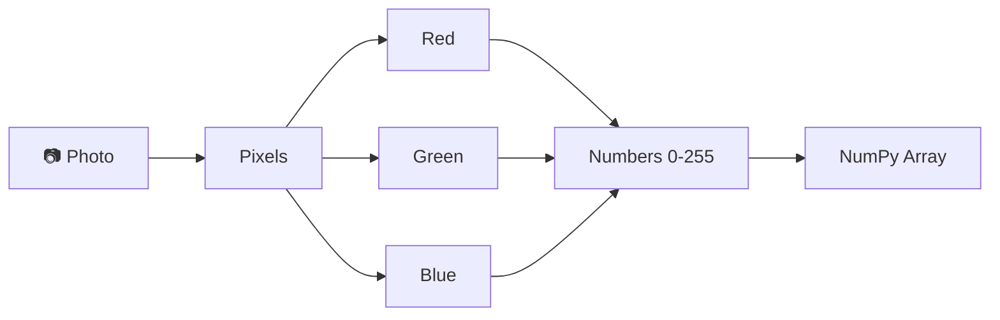
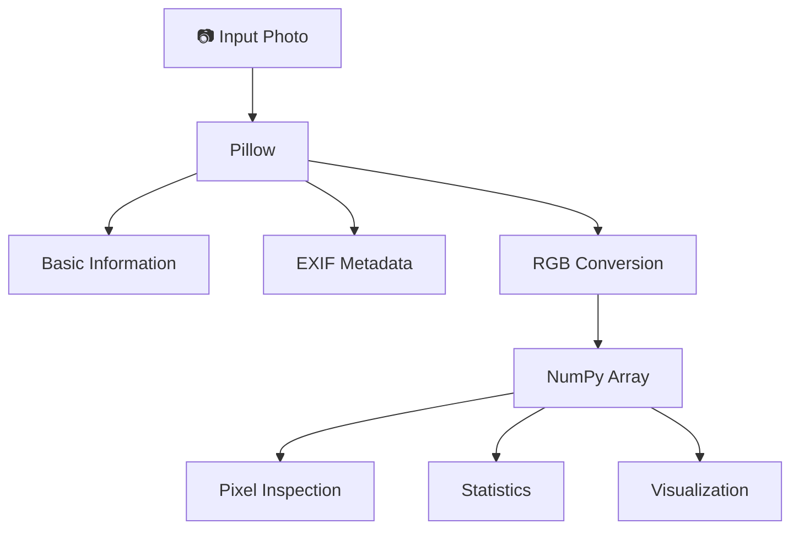

<h1 align="center">📸 Image Analyzer — From Photo to Numbers</h1>

<p align="center">
  <b>A simple Python project that reveals what a digital image really is: numbers.</b>
</p>

<p align="center">
  
  
  
  
</p>

<p align="center">
  Program Python satu file yang "membongkar" sebuah foto: dari metadata kamera,
  resolusi, dan lokasi GPS, hingga nilai RGB setiap pixel dalam bentuk array NumPy.
</p>

<p align="center">
  <!-- Replace with actual project screenshot -->
  <!--  -->
</p>

---

## 📖 About The Project

**Image Analyzer** dibuat untuk tugas *Pengolahan Citra Digital* dengan satu tujuan:
membuktikan bahwa foto yang terlihat oleh manusia sebenarnya direpresentasikan
komputer sebagai **kumpulan angka**.

Program membaca satu foto, lalu menampilkan isinya secara bertahap, mulai dari informasi
umum, metadata, sampai nilai numerik pixel.

```text
Photo
  ↓
Pixels
  ↓
RGB Channels
  ↓
Numbers (0–255)
  ↓
NumPy Array
```



---

## 🎯 What Does This Project Prove?

**"Apakah sebuah foto sebenarnya hanya kumpulan angka?"**

Ya. Program ini menunjukkannya langsung dari foto Anda sendiri:

- Gambar tersusun dari **pixel**.
- Setiap pixel memiliki **nilai warna**.
- Pada RGB, setiap pixel punya **tiga nilai**: Red, Green, Blue.
- Pada representasi 8-bit, setiap nilai berada pada rentang **0–255**.
- Seluruh pixel dapat disimpan sebagai **NumPy array**.
- Komputer memproses gambar lewat representasi numerik tersebut, bukan lewat "gambar" yang kita lihat.

---

## ✨ Features

| Feature | Description |
| --- | --- |
| 🖼️ Image Information | Menampilkan nama file, format, resolusi, width, height, mode, jumlah channel, dan total pixel |
| 📋 EXIF Metadata | Membaca tanggal pengambilan, merek dan model kamera, software, orientasi, focal length, ISO, exposure time, dan aperture jika tersedia |
| 📍 GPS Extraction | Membaca koordinat GPS (derajat-menit-detik), mengubahnya ke desimal, dan membuat link Google Maps jika data valid |
| 🔢 Pixel Analysis | Mengubah gambar menjadi NumPy array dan menampilkan shape serta tipe datanya |
| 🔍 Pixel Samples | Menampilkan nilai RGB pada beberapa koordinat `(y, x)` |
| 🧮 Pixel Matrix | Menampilkan potongan matrix 5 × 5 pixel |
| 📊 Pixel Statistics | Menghitung nilai minimum, maksimum, dan rata-rata, baik keseluruhan maupun per channel R/G/B |
| 📈 Visualization | Menampilkan foto dari array, channel merah, dan zoom 8 × 8 pixel lengkap dengan angkanya |

---

## 🛠️ Tech Stack

| Technology | Purpose |
| --- | --- |
| Python 3 | Core programming language |
| Pillow | Membuka gambar, membaca informasi dasar dan metadata EXIF |
| NumPy | Representasi numerik gambar (array) dan perhitungan statistik |
| Matplotlib | Visualisasi gambar, channel, dan nilai pixel |

---

## ⚙️ How It Works

### Step 1 — Load Image
Foto dibuka menggunakan Pillow lewat `Image.open()`. Pada tahap ini foto belum menjadi array angka.

### Step 2 — Read Basic Information
Program membaca nama file, format, width, height, mode, jumlah channel, dan total pixel.

### Step 3 — Extract EXIF
Program mencoba membaca tanggal pengambilan, kamera, model, software, orientation, focal length, ISO, exposure time, aperture, dan GPS.
Hanya metadata yang benar-benar ada yang ditampilkan. Jika foto tidak punya EXIF, program menampilkan `Metadata EXIF tidak tersedia.` dan tidak error. Untuk GPS, koordinat dianggap valid hanya jika penanda arah (`N/S` dan `E/W`) terisi.

### Step 4 — Convert Image to RGB
Gambar dikonversi ke mode RGB agar setiap pixel selalu memiliki tiga channel (PNG bisa berupa RGBA atau grayscale).

### Step 5 — Convert Image to NumPy Array
Inilah tahap ketika gambar menjadi data numerik:

```python
image_array = np.array(image_rgb)
```

### Step 6 — Analyze Pixel Values
Array memiliki bentuk:

```text
(height, width, channel)
```

dengan contoh arti warna:

```text
[255, 0, 0]       → Red
[0, 255, 0]       → Green
[0, 0, 255]       → Blue
[0, 0, 0]         → Black
[255, 255, 255]   → White
```

### Step 7 — Statistics
Program menghitung nilai minimum, maksimum, dan rata-rata untuk seluruh array, lalu untuk channel Red, Green, dan Blue.

### Step 8 — Visualization
Program menampilkan tiga panel: foto asli dari array, channel merah, dan zoom pixel beserta nilai numeriknya.

---

## 🧭 Visual Pipeline



---

## 🔢 The Moment a Photo Becomes Numbers

Seluruh project berpusat pada satu baris:

```python
image_array = np.array(image_rgb)
```

Sebelum baris ini, foto hanyalah objek gambar milik Pillow. Sesudahnya, foto menjadi tabel angka yang bisa dihitung, diiris, dan dianalisis.

```text
Image
 ↓
┌───────────────┐
│ Pixel  Pixel  │
│ Pixel  Pixel  │
└───────────────┘
 ↓
RGB values
 ↓
[
  [[120, 80, 50], [121, 81, 51]],
  [[130, 90, 60], [140, 100, 70]]
]
```

> Angka di atas hanya **contoh konseptual**, bukan hasil dari foto tertentu.

Setiap `[R, G, B]` adalah tiga nilai numerik yang merepresentasikan warna satu pixel.

---

## 🧮 Image as a Matrix

Bentuk array gambar RGB adalah:

```text
(height, width, 3)
```

Sebagai **contoh**, shape `(1080, 1920, 3)` berarti:

- 1080 baris pixel
- 1920 kolom pixel
- 3 channel warna

```text
1080 × 1920 = 2,073,600 pixels   (contoh perhitungan)
```

Pada program ini, nilai sebenarnya dibaca langsung dari foto yang Anda gunakan.

---

## 🔍 Inside a Single Pixel

Contoh ilustrasi satu pixel:

```text
Pixel
┌───────────────┐
│ R = 120       │
│ G = 85        │
│ B = 42        │
└───────────────┘
```

```text
[120, 85, 42]
```

adalah representasi numerik dari satu pixel RGB. Pada program, pixel diambil dengan `image_array[y, x]`: **baris (y) dulu, baru kolom (x)**, sesuai cara NumPy mengurutkan indeks.

---

## 📋 EXIF Metadata

> **Metadata ≠ Pixel**

Metadata adalah informasi *tentang* foto. Pixel adalah isi visual foto itu sendiri. Menghapus metadata tidak mengubah tampilan foto.

| Metadata | Meaning |
| --- | --- |
| `DateTimeOriginal` | Waktu pengambilan |
| `Make` | Merek kamera |
| `Model` | Model kamera |
| `Software` | Software kamera |
| `Orientation` | Instruksi orientasi tampilan |
| `FocalLength` | Focal length |
| `ISOSpeedRatings` | ISO |
| `ExposureTime` | Waktu exposure |
| `FNumber` | Aperture |
| GPS | Lokasi, jika tersedia dan valid |

Tidak semua foto memiliki EXIF. Foto hasil screenshot, atau yang dikirim lewat aplikasi pesan, sering kehilangan metadata tersebut.

---

## 📊 Visualization

<p align="center">
  <!-- Replace with actual project screenshot -->
  <!--  -->
</p>

**① Original Image** — gambar direkonstruksi dari NumPy array, dengan kotak merah yang menandai area zoom.

**② Red Channel** — intensitas channel merah dari 0 (hitam) sampai 255 (putih).

**③ Pixel Zoom** — area 8 × 8 pixel dari channel merah, dengan nilai angka tertulis di setiap pixel.

---

## 💻 Example Output

Format output terminal (nilai bergantung pada foto yang digunakan):

```text
=== INFORMASI GAMBAR ===
Nama file       : foto.jpg
Format          : ...
Resolusi        : ... x ...
Width (lebar)   : ... pixel
Height (tinggi) : ... pixel
Mode            : RGB
Jumlah channel  : 3
Total pixel     : ...

=== METADATA EXIF ===
Tanggal pengambilan : ...
Merek kamera        : ...
Model kamera        : ...
GPS Latitude        : ...
GPS Longitude       : ...
Koordinat (Maps)    : ...
Link Google Maps    : ...

=== REPRESENTASI ANGKA ===
Shape array : (height, width, 3)
Data type   : uint8

=== CONTOH NILAI PIXEL ===
Pixel (0, 0) : [R G B] -> R=..., G=..., B=...

=== POTONGAN MATRIX PIXEL (5 baris x 5 kolom pertama) ===
...

=== STATISTIK PIXEL (semua channel) ===
Nilai minimum   : ...
Nilai maksimum  : ...
Nilai rata-rata : ...

=== STATISTIK PER CHANNEL ===
Red   -> min ..., max ..., rata-rata ...
Green -> min ..., max ..., rata-rata ...
Blue  -> min ..., max ..., rata-rata ...
```

<!-- [Add actual output screenshot here] -->

---

## 📁 Project Structure

```text
image-analyzer/
├── analisis_foto.py     # program utama (satu file)
├── foto.jpg             # foto yang dianalisis (gunakan foto Anda sendiri)
├── README.md
└── assets/              # gambar untuk README (tambahkan sendiri)
```

---

## 🚀 Getting Started

### Requirements

- Python 3.x
- Pillow
- NumPy
- Matplotlib

### Install dependencies

```bash
pip install pillow numpy matplotlib
```

### Add your image

Letakkan foto di folder yang sama dengan script, lalu sesuaikan nama file di bagian atas program:

```python
image_path = "foto.jpg"
```

### Run

```bash
python analisis_foto.py
```

Untuk hasil metadata terlengkap, gunakan foto asli dari galeri pribadi (bukan hasil kiriman aplikasi pesan).

---

## 🧩 Code Highlights

**1. Mengubah foto menjadi angka**

```python
image_rgb = image.convert("RGB")
image_array = np.array(image_rgb)
```

`convert("RGB")` memastikan setiap pixel punya tiga channel. `np.array()` menyalin seluruh pixel ke array bertipe `uint8` (0–255).

**2. Memisahkan channel warna**

```python
red_channel = image_array[:, :, 0]
```

Artinya: semua baris, semua kolom, channel ke-0 (Red). Indeks `1` untuk Green dan `2` untuk Blue.

**3. Mengubah GPS menjadi koordinat desimal**

```python
lat_desimal = float(lat[0]) + float(lat[1]) / 60 + float(lat[2]) / 3600
```

Nilai GPS di EXIF berupa derajat, menit, dan detik. `float()` diperlukan karena Pillow menyimpannya sebagai pecahan. Hasilnya bernilai negatif untuk Selatan (S) dan Barat (W).

---

## 🎓 What You Learn

- Image representation dan konsep pixel
- Model warna RGB dan channel
- NumPy array dan matrix, termasuk shape `(height, width, channel)`
- Slicing array untuk mengambil pixel dan channel
- Metadata EXIF, serta perbedaannya dengan data pixel
- Dimensi dan resolusi gambar
- Representasi numerik 8-bit (`uint8`, 0–255)
- Pengolahan gambar dasar dan statistik pixel
- Visualisasi data dengan Matplotlib

---

## 💡 Key Takeaway

```text
📷 PHOTO
   ↓
🟦 PIXELS
   ↓
🎨 RGB
   ↓
🔢 NUMBERS
   ↓
🧮 NUMPY ARRAY
```

> **What we see as an image, a computer sees as numbers.**

---

## ⚠️ Limitations

- EXIF tidak selalu tersedia, dan sebagian metadata bisa kosong.
- GPS hanya tampil jika koordinat benar-benar tersimpan di dalam file foto. Lokasi yang terlihat di aplikasi galeri belum tentu ikut tersimpan di file.
- Program berfokus pada **satu gambar** per eksekusi.
- Array tidak otomatis menerapkan tag `Orientation` dari EXIF, sehingga foto portrait bisa memiliki shape landscape.
- Nilai RGB menggunakan representasi 8-bit setelah gambar dikonversi ke RGB.
- Visualisasi ditampilkan lewat jendela Matplotlib dan tidak disimpan otomatis menjadi file.

---

## 🛣️ Future Development

Ide pengembangan berikut masih berupa rencana dan **belum tersedia** di versi saat ini:

- [ ] Analisis beberapa gambar sekaligus
- [ ] Histogram RGB
- [ ] Analisis grayscale
- [ ] Perbandingan ukuran gambar
- [ ] Edge detection
- [ ] Distribusi warna
- [ ] Visualisasi interaktif
- [ ] Drag & drop image
- [ ] Antarmuka web

---

## 👨‍💻 Author

**Muhammad Sahal Anwar Hadi**

<!-- Add GitHub profile link here -->

---

<p align="center">
  <sub>Made for learning digital image processing with Python.</sub>
</p>