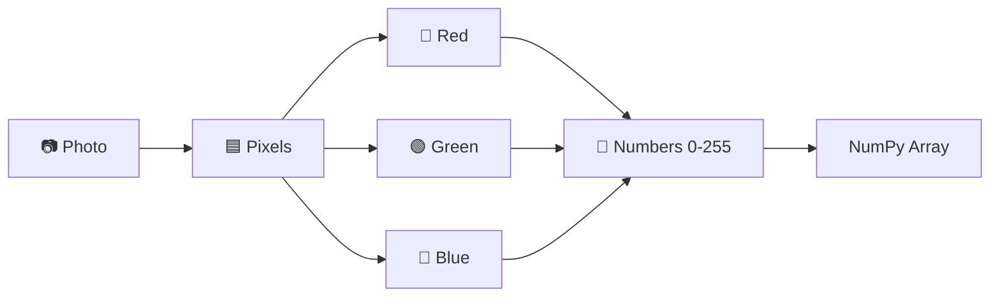
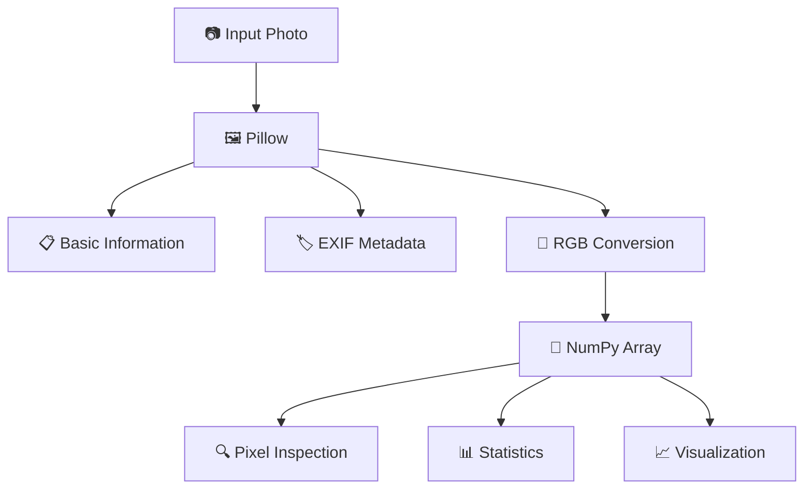

<div align="center">

# 📸 Image Analyzer — From Photo to Numbers

> **A simple Python project that reveals what a digital image really is: numbers.**

Proyek edukasional ini membongkar representasi digital dari sebuah foto untuk membuktikan secara visual dan matematis bahwa apa yang mata kita lihat sebagai sebuah gambar, komputer memprosesnya sebagai kumpulan matriks angka.


<!-- Add your hero screenshot here in the future -->
<!--  -->

</div>

---

## 📖 About The Project

Proyek ini mendemonstrasikan sebuah konsep fundamental dalam ilmu komputer dan pemrosesan citra digital: **sebuah foto sebenarnya hanyalah sekumpulan angka.** 

Program ini mengambil sebuah file foto (seperti `.jpg`), membaca strukturnya, dan membongkar representasinya lapis demi lapis dari sebuah gambar visual menjadi susunan matriks data menggunakan library Python.



---

## 🎯 What Does This Project Prove?

**"Apakah sebuah foto sebenarnya hanya kumpulan angka?"**

Jawabannya adalah **Ya**. Proyek ini secara langsung membuktikan hal tersebut dengan membedah foto menjadi elemen terkecilnya:
- Gambar tersusun dari jutaan titik kecil yang disebut **pixel**.
- Setiap pixel memiliki nilai warna.
- Dalam format RGB, warna tersebut memiliki tiga nilai ukur: Merah (Red), Hijau (Green), dan Biru (Blue).
- Setiap nilai warna berada pada rentang **0–255** (representasi 8-bit).
- Seluruh pixel tersebut dapat disimpan dan diproses oleh komputer sebagai sebuah **NumPy Array**.

---

## ✨ Features

Program ini membaca dan memproses gambar untuk menghasilkan berbagai analisis berikut:

| Feature               | Description                                                   |
| --------------------- | ------------------------------------------------------------- |
| 🖼️ Image Information  | Menampilkan nama file, format, resolusi, mode, channel, dan jumlah pixel |
| 📋 EXIF Metadata      | Membaca metadata bawaan kamera (seperti ISO, Exposure, Focal Length) jika tersedia |
| 📍 GPS Extraction     | Mengekstrak koordinat GPS dan membuahkan link Google Maps otomatis (jika ada) |
| 🔢 Pixel Analysis     | Mengubah gambar visual utuh menjadi struktur array angka        |
| 🎨 RGB Analysis       | Membedah komposisi warna dasar Red, Green, dan Blue           |
| 📊 Pixel Statistics   | Menghitung nilai minimum, maksimum, dan rata-rata intensitas pixel |
| 🔍 Pixel Zoom         | Melihat inspeksi nilai pixel secara detail pada area 8x8      |
| 🧮 Pixel Matrix       | Menampilkan potongan matrix angka murni (5x5 baris/kolom pertama) |
| 📈 Visualization      | Memvisualisasikan gambar asli, channel merah, dan angka dalam pixel melalui Matplotlib |

---

## 🛠️ Tech Stack

Project ini murni menggunakan Python dan pustaka standar untuk data science.

| Technology | Purpose                               |
| ---------- | ------------------------------------- |
| Python     | Core programming language             |
| Pillow     | Image reading, conversion, & EXIF extraction |
| NumPy      | Numerical image representation & matrix computation |
| Matplotlib | Data and image visualization          |

---

## ⚙️ How It Works

Proyek ini berjalan secara berurutan mengikuti pipeline pemrosesan citra standar:

### Step 1 — Load Image
Foto (default: `foto3.jpg`) dibuka ke dalam memori menggunakan library Pillow (`PIL`).

### Step 2 — Read Basic Information
Program membaca metadata dasar file seperti nama file, format file, lebar (*width*), tinggi (*height*), mode warna, jumlah channel, dan mengkalkulasi total keseluruhan pixel.

### Step 3 — Extract EXIF
Program memindai *Exchangeable Image File Format* (EXIF) untuk mencari tahu:
- Kapan foto diambil
- Menggunakan kamera & lensa apa (Make, Model, Focal Length, Aperture, ISO, Exposure Time)
- Titik koordinat lokasi GPS (diubah menjadi format desimal)
*(Catatan: Program dirancang untuk aman dari error jika foto tidak memiliki EXIF).*

### Step 4 — Convert Image to RGB
Gambar dipaksa dikonversi menjadi format standar RGB (3 channel) untuk menghindari inkonsistensi dari format `.png` (RGBA) atau gambar hitam putih (*grayscale*).

### Step 5 — Convert Image to NumPy Array
Momen transisi utama:
```python
image_array = np.array(image_rgb)
```
Disinilah representasi gambar sepenuhnya berubah dari format visual menjadi format matematis (*data numerik*).

### Step 6 — Analyze Pixel Values
Program melihat bentuk (*shape*) data yaitu `(height, width, channel)` dan membedah makna nilai kombinasinya:
- `[255, 0, 0]` → Merah maksimal
- `[0, 255, 0]` → Hijau maksimal
- `[0, 0, 255]` → Biru maksimal

### Step 7 — Statistics
Program menggunakan perhitungan matematis NumPy untuk menghitung nilai terendah, tertinggi, dan rata-rata pixel, baik secara keseluruhan maupun per-channel (Red, Green, Blue).

### Step 8 — Visualization
Menggunakan Matplotlib, program akan merender pop-up GUI yang menampilkan 3 panel: foto hasil konstruksi array, visualisasi channel merah secara spesifik, dan area pixel yang di-*zoom* beserta nilai angkanya.

---

## 🗺️ Visual Pipeline



---

## 🔢 The Moment a Photo Becomes Numbers

Bagian paling esensial dari kode ini hanyalah satu baris:

```python
image_array = np.array(image_rgb)
```

Pada baris ini, komputer menelanjangi ilusi visual yang kita lihat. Sebuah gambar berubah bentuk menjadi matriks 3 dimensi yang berisi deretan angka seperti ini:

```text
Image (Visual)
 ↓
┌───────────────┐
│ Pixel  Pixel  │
│ Pixel  Pixel  │
└───────────────┘
 ↓
RGB values
 ↓
[
  [[120, 80, 50], [121, 81, 51]],
  [[130, 90, 60], [140, 100, 70]]
]
```

Nilai `[R, G, B]` adalah representasi numerik absolut yang memberitahu layar Anda seberapa terang lampu merah, hijau, dan biru harus dinyalakan pada satu titik spesifik.

---

## 🧮 Image as a Matrix

Saat dikonversi, gambar memiliki dimensi *shape* `(height, width, 3)`.

Sebagai **contoh ilustrasi**, jika Anda memasukkan foto beresolusi 1080p:
Shape-nya adalah `(1080, 1920, 3)`. 
Ini berarti komputer melihat matriks dengan:
- 1080 baris pixel ke bawah
- 1920 kolom pixel ke samping
- 3 channel warna untuk setiap perpotongan baris dan kolom.

Total pixel yang harus diproses adalah `1080 × 1920 = 2,073,600` pixel.

---

## 🔍 Inside a Single Pixel

Jika kita mengambil satu titik pixel saja di dalam memori komputer, strukturnya akan terlihat seperti ini:

```text
Single Pixel Data
┌───────────────┐
│ R = 120       │
│ G = 85        │
│ B = 42        │
└───────────────┘
```
Dalam program Python, ini ditulis sederhana sebagai array satu dimensi: `[120, 85, 42]`.

---

## 📋 EXIF Metadata

Penting untuk membedakan antara informasi gambar dan gambar itu sendiri.
> **Metadata ≠ Pixel**

Metadata adalah data yang *mendeskripsikan* foto, yang disisipkan oleh kamera Anda, sementara pixel adalah isi data visualnya. Program ini dapat membaca:

| Metadata         | Meaning              |
| ---------------- | -------------------- |
| DateTimeOriginal | Waktu pengambilan    |
| Make             | Merek kamera         |
| Model            | Model kamera         |
| FocalLength      | Focal length lensa   |
| ISO              | Sensitivitas sensor  |
| ExposureTime     | Waktu exposure       |
| FNumber          | Bukaan (Aperture)    |
| GPS              | Titik lokasi absolut |

*(Catatan: Metadata ini tidak selalu ada; jika Anda men-download foto dari media sosial seperti WhatsApp atau Instagram, biasanya EXIF ini sudah dihapus).*

---

## 📊 Visualization

Program ini akan memunculkan jendela Matplotlib dengan tiga panel interaktif:

<p align="center">
  <!-- Replace with actual project screenshot -->
  
</p>

### ① Original Image
Gambar utuh yang direkonstruksi ulang dan digambar secara visual murni dari NumPy array.

### ② Red Channel
Menunjukkan secara spesifik intensitas warna *Red* (Merah). Bagian putih berarti nilai merahnya mendekati 255 (terang), dan hitam berarti mendekati 0.

### ③ Pixel Zoom
Menampilkan area sangat kecil berukuran 8x8 pixel dari tengah gambar. Disini nilai angka setiap titik akan dituliskan langsung di atas warnanya.

---

## 💻 Example Output

Saat Anda menjalankan program di terminal, outputnya akan terlihat kurang lebih seperti ini (angka aktual bergantung pada foto Anda):

```text
=== INFORMASI GAMBAR ===
Nama file       : foto3.jpg
Format          : JPEG
Resolusi        : 1920 x 1080
Width (lebar)   : 1920 pixel
Height (tinggi) : 1080 pixel
Mode            : RGB
Jumlah channel  : 3
Total pixel     : 2073600

=== REPRESENTASI ANGKA ===
Shape array : (1080, 1920, 3)
Data type   : uint8

=== POTONGAN MATRIX PIXEL (5 baris x 5 kolom pertama) ===
[[[120  80  50]
  [121  81  51]
  ...
```

---

## 📁 Project Structure

```text
image-analyzer/
├── analisis_foto.py       # Core program script
├── foto3.jpg              # Default image input 
├── README.md              # Project documentation
└── assets/                # Folder for documentation images
```

---

## 🚀 Getting Started

### Requirements
- Python 3.x terinstall di komputer Anda.

### 1. Install Dependencies
Buka terminal/CMD dan install library yang dibutuhkan:
```bash
pip install pillow numpy matplotlib
```

### 2. Add your image
Letakkan foto Anda di folder yang sama dengan file script.
Buka file `analisis_foto.py`, lalu ubah nama file pada baris input jika Anda menggunakan nama gambar yang berbeda:
```python
image_path = "foto3.jpg" # Ganti dengan nama foto Anda
```

### 3. Run the Program
Eksekusi program melalui terminal:
```bash
python analisis_foto.py
```

---

## 💻 Code Highlight

Dua baris kode ini adalah inti utama dari keseluruhan proyek:

```python
image_rgb = image.convert("RGB")
image_array = np.array(image_rgb)
```
**Mengapa ini penting?** 
Baris pertama memastikan bahwa foto memiliki standar yang seragam (memiliki ruang warna Red, Green, dan Blue). Baris kedua adalah jembatan dari dunia desain grafis/visual ke dunia *data science* & komputasi numerik dengan mengubahnya menjadi array.

---

## 🎓 What You Learn

Proyek sederhana ini mencakup banyak konsep teknis fundamental:
- **Image Representation**: Bagaimana komputer memanipulasi gambar.
- **Pixel & RGB**: Anatomi terkecil dari tampilan visual.
- **Matrix & NumPy Arrays**: Konsep baris dan kolom dalam data numerik Python.
- **EXIF Metadata**: Cara membaca data tersembunyi dari sensor kamera.
- **Data Visualization**: Memetakan angka ke dalam grafik menggunakan Matplotlib.

---

## 💡 Key Takeaway

```text
📷 PHOTO
   ↓
🟦 PIXELS
   ↓
🎨 RGB
   ↓
🔢 NUMBERS
   ↓
🧮 NUMPY ARRAY
```

> **What we see as an image, a computer sees as numbers.**

---

## ⚠️ Limitations

- **EXIF & GPS Ketergantungan File:** Program ini hanya bisa membaca EXIF/GPS jika foto tersebut masih menyimpan datanya. (Gambar hasil edit atau kiriman chat biasanya kehilangan data ini).
- **Single Image Analysis:** Saat ini program hanya ditujukan untuk membaca satu file hardcoded yang ditentukan di dalam kode.
- **Visualisasi Statis:** Visualisasi di-render menggunakan Matplotlib window yang bersifat pop-up, bukan antarmuka web.
- **8-bit Limit:** Representasi nilai dibatasi dari 0 hingga 255 (*uint8*).

---

## 🛣️ Future Development

Beberapa ide pengembangan yang bisa dilakukan ke depannya untuk proyek ini:
- [ ] Menerima input gambar melalui *Drag & Drop* atau *Command Line Arguments (CLI)*.
- [ ] Menambahkan perbandingan visual histogram distribusi warna RGB.
- [ ] Menganalisis proporsi komposisi warna (color distribution).
- [ ] Mengimplementasikan *Edge Detection* (Deteksi tepi) sederhana dengan modifikasi array numerik.
- [ ] Membungkus output ke dalam format Web Interface interaktif.

---

## 👨‍💻 Author

**Muhammad Sahal Anwar Hadi**

*(Repository ini dibuat sebagai bentuk eksplorasi edukasional pada Python, Image Processing, dan struktur data).*