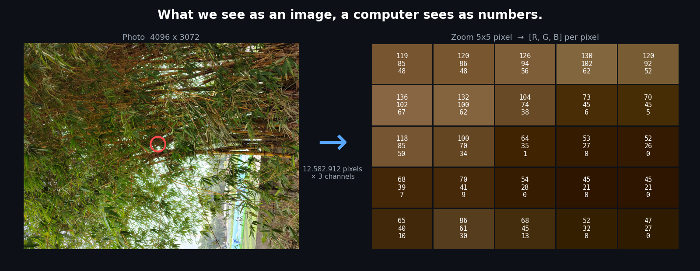
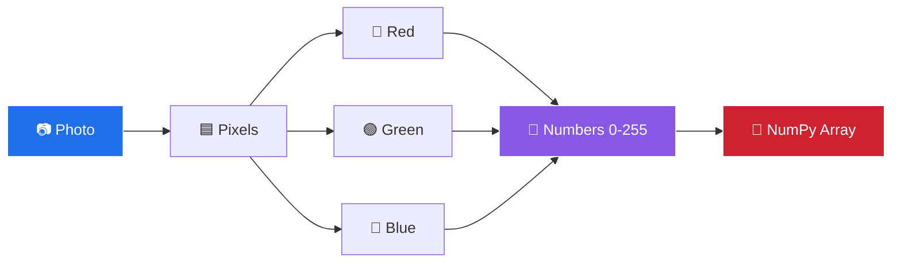
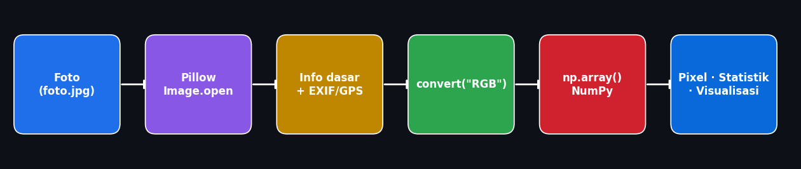
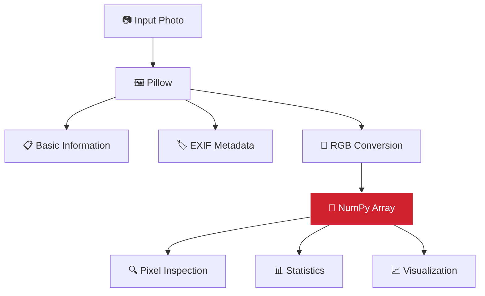
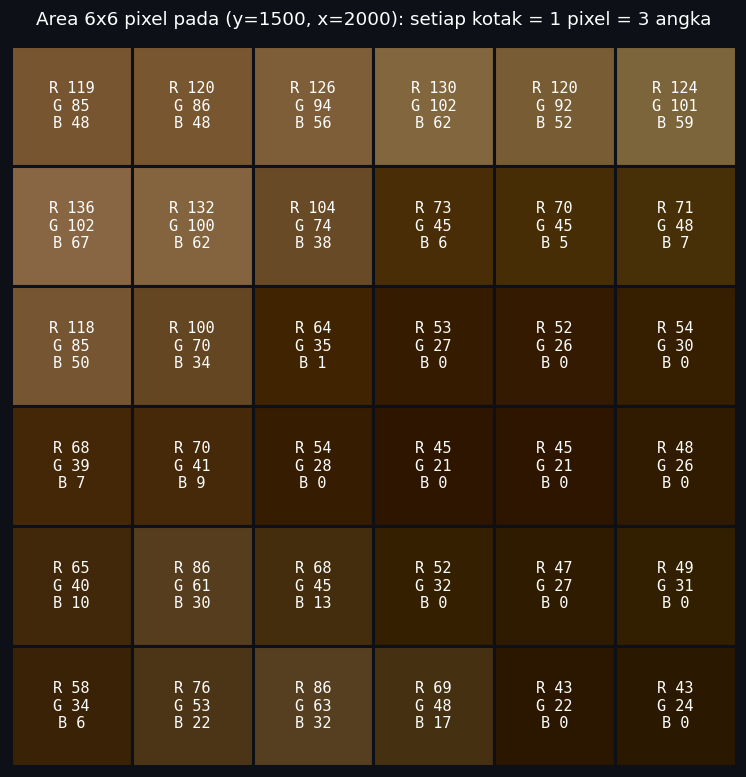
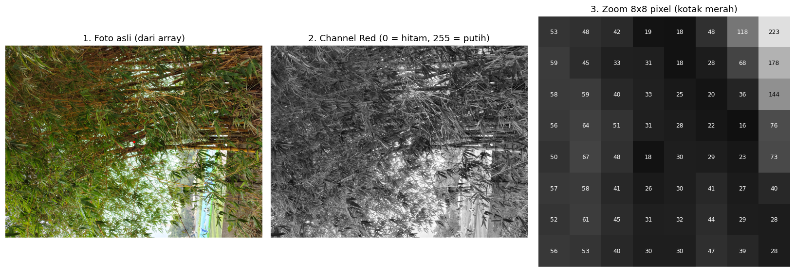

<div align="center">


**A simple Python project that reveals what a digital image really is: numbers.**


<br><br>



<sub>Foto asli (kiri) dan zoom 5 × 5 pixel (kanan). Setiap kotak adalah satu pixel, dan angka di dalamnya adalah nilai <b>R, G, B</b>-nya.</sub>

</div>

---

## 📖 About The Project

**Image Analyzer** adalah program Python **satu file** untuk tugas *Pengolahan Citra Digital*. Tujuannya satu: membuktikan bahwa foto yang kita lihat sebenarnya disimpan dan diproses komputer sebagai **kumpulan angka**.

Program membaca satu foto, lalu "membongkarnya" langkah demi langkah:




---

## 🎯 What Does This Project Prove?

### ❓ *"Apakah sebuah foto sebenarnya hanya kumpulan angka?"*

### ✅ Ya. Buktinya ada di program ini.

| # | Fakta | Bukti di program |
|:-:|---|---|
| 1 | Gambar tersusun dari **pixel** | Total pixel dihitung dari `width × height` |
| 2 | Setiap pixel punya **nilai warna** | `image_array[y, x]` menghasilkan angka |
| 3 | RGB punya **3 nilai** per pixel | Shape array berakhir dengan `3` |
| 4 | Setiap nilai berada di **0–255** (8-bit) | Statistik: min `0`, max `255`, tipe `uint8` |
| 5 | Semua pixel bisa disimpan sebagai **NumPy array** | `np.array(image_rgb)` |
| 6 | Komputer memproses **angkanya**, bukan "gambarnya" | Min, max, dan rata-rata dihitung dari array |

---

## ✨ Features

<table>
  <tr>
    <td width="50%" valign="top">
      <h4>🖼️ Image Information</h4>
      Nama file, format, resolusi, width, height, mode, jumlah channel, dan total pixel.
    </td>
    <td width="50%" valign="top">
      <h4>📋 EXIF Metadata</h4>
      Tanggal pengambilan, merek dan model kamera, software, orientasi, focal length, ISO, exposure time, dan aperture <i>jika tersedia</i>.
    </td>
  </tr>
  <tr>
    <td valign="top">
      <h4>📍 GPS Extraction</h4>
      Koordinat derajat-menit-detik diubah ke desimal, lengkap dengan <b>link Google Maps</b>. Hanya ditampilkan jika datanya valid.
    </td>
    <td valign="top">
      <h4>🔢 Pixel Analysis</h4>
      Gambar diubah menjadi NumPy array, lengkap dengan shape dan tipe datanya.
    </td>
  </tr>
  <tr>
    <td valign="top">
      <h4>🔍 Pixel Samples & Matrix</h4>
      Nilai RGB di beberapa koordinat <code>(y, x)</code> dan potongan matrix 5 × 5 pixel.
    </td>
    <td valign="top">
      <h4>📊 Pixel Statistics</h4>
      Minimum, maksimum, dan rata-rata untuk seluruh array, serta per channel Red, Green, dan Blue.
    </td>
  </tr>
  <tr>
    <td colspan="2" valign="top">
      <h4>📈 Visualization</h4>
      Foto dari array, channel merah (grayscale), dan zoom 8 × 8 pixel dengan angka tertulis di setiap pixel.
    </td>
  </tr>
</table>

---

## 🛠️ Tech Stack

| Technology | Purpose |
|---|---|
|  | Bahasa pemrograman utama |
|  | Membuka gambar, membaca informasi dasar dan metadata EXIF |
|  | Representasi numerik gambar dan perhitungan statistik |
|  | Visualisasi gambar, channel, dan nilai pixel |

---

## ⚙️ How It Works

<p align="center">
  
</p>

<details open>
<summary><b>Step 1 — Load Image</b></summary>

Foto dibuka dengan Pillow. Pada tahap ini foto masih berupa objek gambar, belum angka.

```python
image = Image.open(image_path)
```
</details>

<details open>
<summary><b>Step 2 — Read Basic Information</b></summary>

Filename, format, width, height, mode, jumlah channel, dan total pixel (`width × height`).
</details>

<details open>
<summary><b>Step 3 — Extract EXIF & GPS</b></summary>

Program membaca tanggal pengambilan, kamera, model, software, orientation, focal length, ISO, exposure time, dan aperture. Hanya metadata yang benar-benar ada yang ditampilkan.

- Jika foto tidak punya EXIF: `Metadata EXIF tidak tersedia.` (tanpa error)
- Jika GPS kosong atau tidak valid: `GPS tidak tersedia`
- Jika GPS valid: koordinat desimal + link Google Maps
</details>

<details open>
<summary><b>Step 4 — Convert Image to RGB</b></summary>

Gambar dikonversi ke RGB agar setiap pixel selalu memiliki tiga channel (PNG bisa berupa RGBA atau grayscale).
</details>

<details open>
<summary><b>Step 5 — Convert Image to NumPy Array</b></summary>

```python
image_array = np.array(image_rgb)
```

Di sinilah gambar berubah menjadi data numerik. Detailnya ada di bagian [The Moment a Photo Becomes Numbers](#-the-moment-a-photo-becomes-numbers).
</details>

<details open>
<summary><b>Step 6 — Analyze Pixel Values</b></summary>

Array berbentuk `(height, width, channel)`. Contoh arti nilai warna:

```text
[255,   0,   0]  →  Red
[  0, 255,   0]  →  Green
[  0,   0, 255]  →  Blue
[  0,   0,   0]  →  Black
[255, 255, 255]  →  White
```
</details>

<details open>
<summary><b>Step 7 — Statistics</b></summary>

Minimum, maksimum, dan rata-rata untuk seluruh array, lalu untuk channel Red, Green, dan Blue.
</details>

<details open>
<summary><b>Step 8 — Visualization</b></summary>

Tiga panel: foto asli dari array, channel merah, dan zoom pixel dengan nilai numeriknya.
</details>

### 🧭 Visual Pipeline



---

## 🔢 The Moment a Photo Becomes Numbers

> [!IMPORTANT]
> Seluruh project berpusat pada **satu baris** ini.

```python
image_array = np.array(image_rgb)
```

Sebelum baris ini, foto hanyalah objek gambar milik Pillow. Sesudahnya, foto adalah tabel angka yang bisa dihitung, diiris, dan dianalisis.

```text
Image
 ↓
┌───────────────┐
│ Pixel  Pixel  │
│ Pixel  Pixel  │
└───────────────┘
 ↓
RGB values
 ↓
[
  [[120, 80, 50], [121, 81, 51]],
  [[130, 90, 60], [140, 100, 70]]
]
```

> Angka pada diagram di atas adalah **contoh konseptual**. Angka nyata dari foto sampel ada di gambar berikut.

<p align="center">
  
</p>

<p align="center"><sub>Area 6 × 6 pixel dari foto sampel. Warna setiap kotak dibuat dari tiga angka di dalamnya.</sub></p>

---

## 🧮 Image as a Matrix

Gambar RGB disimpan sebagai array dengan bentuk:

```text
(height, width, 3)
```

Sebagai **contoh**, shape `(1080, 1920, 3)` berarti 1080 baris pixel, 1920 kolom pixel, dan 3 channel warna:

```text
1080 × 1920 = 2,073,600 pixels   (contoh perhitungan)
```

Pada foto sampel di repository ini, nilai nyatanya:

| | Value |
|---|---|
| Shape | `(3072, 4096, 3)` |
| Total pixel | `3072 × 4096 = 12,582,912` |
| Total angka | `12,582,912 × 3 = 37,748,736` |
| Ukuran file JPEG | sekitar 8,5 MB (hasil kompresi) |

---

## 🔍 Inside a Single Pixel

```text
Pixel
┌───────────────┐
│ R = 120       │
│ G = 85        │
│ B = 42        │
└───────────────┘
```

```text
[120, 85, 42]
```

Contoh di atas adalah ilustrasi satu pixel RGB. Di program, pixel diambil dengan `image_array[y, x]`: **baris (y) dulu, baru kolom (x)**, sesuai cara NumPy mengurutkan indeks.

---

## 📋 EXIF Metadata

> [!TIP]
> **Metadata ≠ Pixel.** Metadata adalah informasi *tentang* foto. Pixel adalah isi visual foto itu sendiri. Menghapus metadata tidak mengubah tampilan foto.

| Metadata | Meaning |
|---|---|
| `DateTimeOriginal` | Waktu pengambilan |
| `Make` | Merek kamera |
| `Model` | Model kamera |
| `Software` | Software kamera |
| `Orientation` | Instruksi orientasi tampilan |
| `FocalLength` | Focal length |
| `ISOSpeedRatings` | ISO |
| `ExposureTime` | Waktu exposure |
| `FNumber` | Aperture |
| GPS | Lokasi, jika tersedia dan valid |

Tidak semua foto memiliki EXIF. Foto screenshot atau foto kiriman aplikasi pesan sering kehilangan metadata tersebut.

---

## 📊 Visualization

<p align="center">
  
</p>

| Panel | Isi |
|---|---|
| **① Original Image** | Gambar direkonstruksi dari NumPy array. Kotak merah menandai area zoom. |
| **② Red Channel** | Intensitas merah dari 0 (hitam) sampai 255 (putih). |
| **③ Pixel Zoom** | Area 8 × 8 pixel dengan nilai angka tertulis di setiap pixel. |

> [!NOTE]
> Foto sampel tampak miring karena HP menyimpan pixel dalam posisi landscape dan hanya menambahkan tag EXIF `Orientation = 6` ("putar saat ditampilkan"). Array NumPy tidak menerapkan tag itu. Ini contoh nyata bahwa **metadata mengubah cara foto ditampilkan, tetapi tidak mengubah angka pixel**.

---

## 💻 Example Output

Output nyata dari foto sampel (HP Motorola, foto tidak memiliki GPS yang tersimpan di file):

<details open>
<summary><b>Klik untuk membuka / menutup output terminal</b></summary>

```text
=== INFORMASI GAMBAR ===
Nama file       : foto.jpg
Format          : JPEG
Resolusi        : 4096 x 3072
Width (lebar)   : 4096 pixel
Height (tinggi) : 3072 pixel
Mode            : RGB
Jumlah channel  : 3
Total pixel     : 12582912

=== METADATA EXIF ===
Tanggal pengambilan : 2026:10:06 15:21:49
Merek kamera        : motorola
Model kamera        : moto g57 power
Orientasi           : 6
Focal length        : 4.81
ISO                 : 227
Exposure time       : 0.007741009
Aperture (F)        : 1.8
GPS                 : tidak tersedia (lokasi tidak direkam saat foto diambil)

=== REPRESENTASI ANGKA ===
Shape array : (3072, 4096, 3)
Data type   : uint8

=== CONTOH NILAI PIXEL ===
Pixel (0, 0)           : [34 40 14] -> R=34, G=40, B=14
Pixel (0, 1)           : [25 32  1] -> R=25, G=32, B=1
Pixel (1, 0)           : [42 46 19] -> R=42, G=46, B=19
Pixel (100, 100)       : [79 74 44] -> R=79, G=74, B=44
Pixel (200, 200)       : [90 87 52] -> R=90, G=87, B=52
Pixel (300, 300)       : [157 158  39] -> R=157, G=158, B=39
Pixel (1536, 2048)     : [53 71 31] -> R=53, G=71, B=31
Pixel (3071, 4095)     : [129 105  59] -> R=129, G=105, B=59

=== POTONGAN MATRIX PIXEL (5 baris x 5 kolom pertama) ===
[[[ 34  40  14]
  [ 25  32   1]
  [ 29  35   1]
  [105 112  70]
  [103 109  61]]
  ...

=== STATISTIK PIXEL (semua channel) ===
Nilai minimum   : 0
Nilai maksimum  : 255
Nilai rata-rata : 85.07

=== STATISTIK PER CHANNEL ===
Red   -> min 0, max 255, rata-rata 98.76
Green -> min 0, max 255, rata-rata 101.83
Blue  -> min 0, max 255, rata-rata 54.62
```

</details>

Jika foto memiliki GPS yang valid, dua baris tambahan muncul di bagian metadata:

```text
Koordinat (Maps)    : <latitude>, <longitude>
Link Google Maps    : https://www.google.com/maps?q=<latitude>,<longitude>
```

---

## 📁 Project Structure

```text
image-analyzer/
├── analisis_foto.py        # program utama (satu file)
├── foto.jpg                # foto yang dianalisis (ganti dengan foto Anda)
├── README.md
└── assets/
    ├── hero.png
    ├── analysis-result.png
    ├── pixel-matrix.png
    └── architecture.png
```

---

## 🚀 Getting Started

**1. Requirements:** Python 3.x, Pillow, NumPy, Matplotlib

**2. Install dependencies**

```bash
pip install pillow numpy matplotlib
```

**3. Add your image**

Letakkan foto di folder yang sama dengan script, lalu sesuaikan nama file di bagian atas program:

```python
image_path = "foto.jpg"
```

**4. Run**

```bash
python analisis_foto.py
```

> [!TIP]
> Untuk metadata terlengkap, gunakan foto asli dari galeri pribadi dengan fitur lokasi kamera aktif, bukan foto yang dikirim lewat aplikasi pesan.

---

## 🧩 Code Highlights

**① Foto menjadi angka**

```python
image_rgb = image.convert("RGB")
image_array = np.array(image_rgb)
```

`convert("RGB")` memastikan setiap pixel punya tiga channel. `np.array()` menyalin seluruh pixel ke array bertipe `uint8` (0–255).

**② Memisahkan channel warna**

```python
red_channel = image_array[:, :, 0]
```

Artinya: semua baris, semua kolom, channel ke-0 (Red). Indeks `1` untuk Green dan `2` untuk Blue.

**③ Mengubah GPS menjadi koordinat desimal**

```python
lat_desimal = float(lat[0]) + float(lat[1]) / 60 + float(lat[2]) / 3600
```

GPS di EXIF berupa derajat, menit, dan detik. `float()` dibutuhkan karena Pillow menyimpannya sebagai pecahan. Hasilnya bernilai negatif untuk Selatan (S) dan Barat (W).

---

## 🎓 What You Learn

| Konsep | Di mana muncul |
|---|---|
| Image representation, pixel | Informasi gambar, total pixel |
| Model warna RGB dan channel | Konversi RGB, pemisahan channel |
| NumPy array dan matrix | Shape `(height, width, channel)`, slicing |
| Metadata EXIF vs data pixel | Metadata, orientasi, GPS |
| Representasi 8-bit (`uint8`, 0–255) | Tipe data dan statistik |
| Basic image processing | Statistik pixel dan per channel |
| Data visualization | Tiga panel Matplotlib |

---

## 💡 Key Takeaway

<div align="center">

```text
📷 PHOTO
   ↓
🟦 PIXELS
   ↓
🎨 RGB
   ↓
🔢 NUMBERS
   ↓
🧮 NUMPY ARRAY
```

### What we see as an image, a computer sees as numbers.

</div>

---

## ⚠️ Limitations

- EXIF tidak selalu tersedia, dan sebagian metadata bisa kosong.
- GPS hanya tampil jika koordinat benar-benar tersimpan **di dalam file** foto. Lokasi yang terlihat di aplikasi galeri belum tentu ikut tersimpan di file.
- Program menganalisis **satu gambar** per eksekusi.
- Array tidak menerapkan tag `Orientation` dari EXIF, sehingga foto portrait bisa berbentuk landscape.
- Nilai RGB memakai representasi 8-bit setelah gambar dikonversi ke RGB.
- Visualisasi hanya ditampilkan lewat jendela Matplotlib dan tidak disimpan otomatis.

---

## 🛣️ Future Development

Ide berikut masih **rencana**, belum tersedia di versi saat ini:

- [ ] Analisis beberapa gambar sekaligus
- [ ] Histogram RGB
- [ ] Analisis grayscale
- [ ] Perbandingan ukuran gambar
- [ ] Edge detection
- [ ] Distribusi warna
- [ ] Visualisasi interaktif
- [ ] Drag & drop image
- [ ] Antarmuka web

---

## 👨‍💻 Author

**Muhammad Sahal Anwar Hadi**

<!-- Add GitHub profile link here -->

<br>

<div align="center">


<sub>Made for learning digital image processing with Python.</sub>

</div>