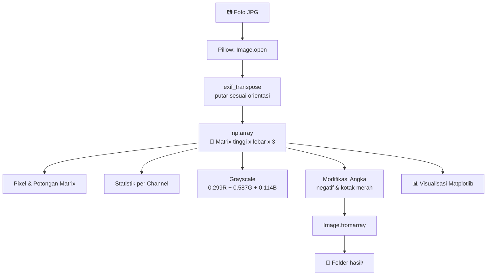
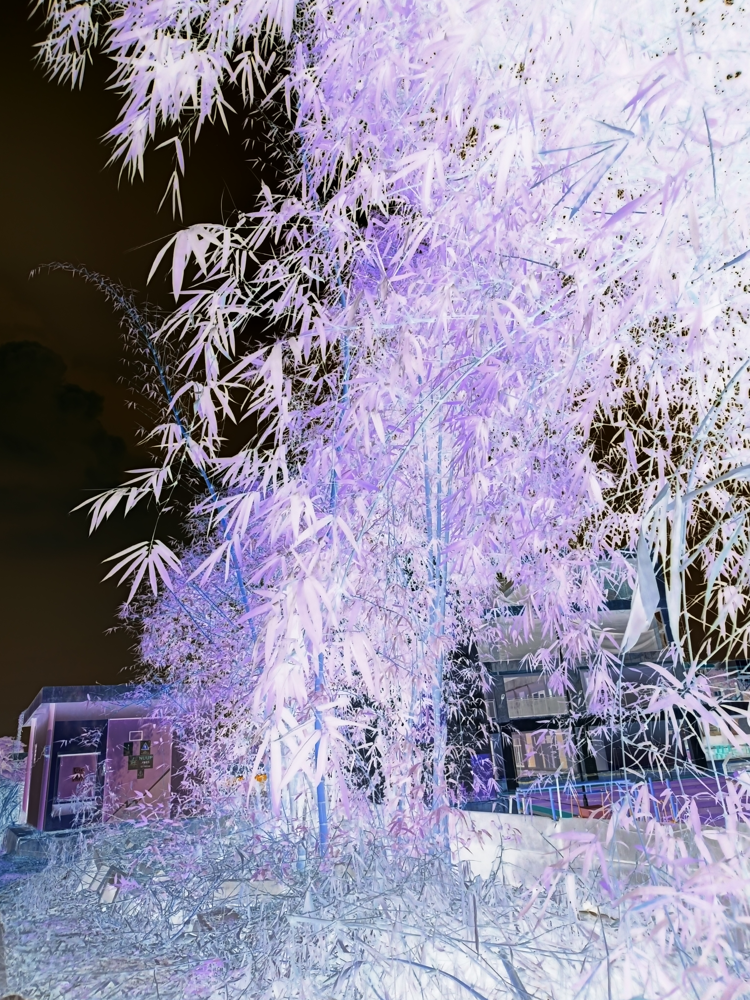
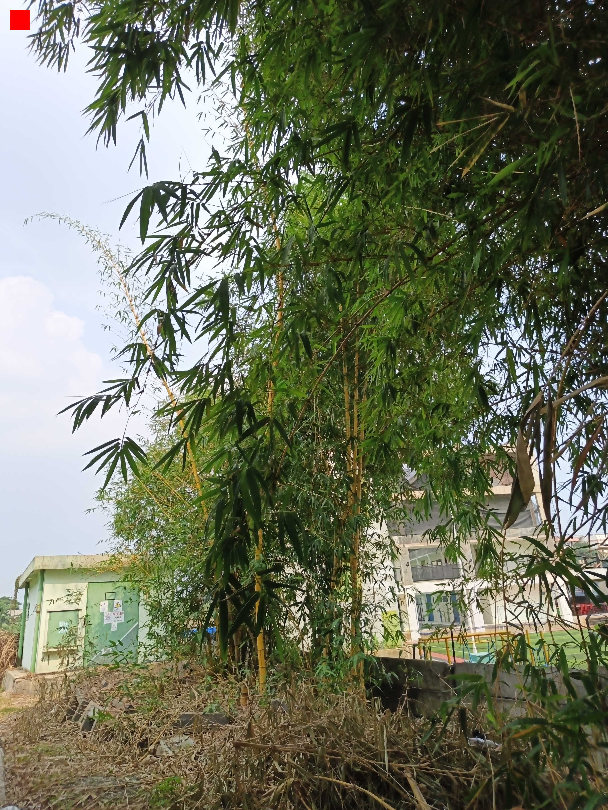

<div align="center">

# 🖼️ Image Analyzer

### *Foto = Pixel = Angka RGB = Array NumPy*

Pembuktian interaktif bahwa **sebuah foto hanyalah susunan angka**,
dibuktikan dua arah: **Foto → Angka** dan **Angka → Foto**.

<br>


<br>

[📖 Tentang](#-tentang-proyek) •
[💡 Konsep](#-konsep-inti) •
[✨ Fitur](#-fitur) •
[📁 Struktur](#-struktur-folder) •
[🚀 Mulai](#-memulai) •
[🧬 Alur Program](#-alur-program) •
[🗺️ Roadmap](#%EF%B8%8F-roadmap)

</div>

---

## 📖 Tentang Proyek

**Image Analyzer** adalah program Python satu file (`main.py`) yang menjawab satu pertanyaan sederhana namun mendasar:

> ❓ *"Apakah sebuah foto benar-benar hanya kumpulan angka?"*

Jawabannya: **ya**. Program ini membuktikannya langkah demi langkah. Ia membuka sebuah foto, mengubahnya menjadi matriks angka, membedah isinya, lalu **merakit kembali angka-angka itu menjadi foto**. Bahkan sebuah gambar bisa dibuat **dari nol tanpa kamera**, hanya dengan menulis angka.

Setiap bagian kode diberi komentar berbahasa Indonesia agar mudah dipahami, dipresentasikan, dan dijelaskan baris per baris.

---

## 💡 Konsep Inti

Sebuah foto digital adalah **grid pixel**. Setiap pixel menyimpan 3 angka: **R**ed, **G**reen, **B**lue, masing-masing bernilai `0–255`.

| Warna | Nilai `[R, G, B]` |
|:------|:-----------------:|
| 🟥 Merah  | `[255,   0,   0]` |
| 🟩 Hijau  | `[  0, 255,   0]` |
| 🟦 Biru   | `[  0,   0, 255]` |
| ⬛ Hitam  | `[  0,   0,   0]` |
| ⬜ Putih  | `[255, 255, 255]` |

Di dalam NumPy, foto menjadi array berbentuk:

```text
(tinggi, lebar, 3)
   │       │     └── channel warna: R, G, B
   │       └──────── jumlah KOLOM pixel
   └──────────────── jumlah BARIS pixel
```

Jumlah kemungkinan warna per pixel: **256 × 256 × 256 = 16.777.216 warna** (24 bit).

---

## ✨ Fitur

| # | Bagian | Apa yang dilakukan |
|:-:|:-------|:-------------------|
| 1 | **Informasi Dasar** | Nama file, format, resolusi, mode warna, total pixel |
| 2 | **Metadata EXIF** | Kamera, ISO, exposure, aperture, focal length, tanggal, dan koordinat GPS |
| 3 | **Foto → Angka** | `np.array(foto)` mengubah foto menjadi matriks angka 0–255 |
| 4 | **Nilai Pixel** | Membaca RGB di pojok kiri atas, tengah, dan pojok kanan bawah |
| 5 | **Potongan Matrix** | Menampilkan 5×5 pixel pertama sebagai angka mentah |
| 6 | **Statistik** | Min, max, rata-rata tiap channel, ukuran array vs file, jumlah warna |
| 7 | **Grayscale** | 3 angka per pixel menjadi 1 angka (rumus kepekaan mata manusia) |
| 8 | **Byte Mentah File** | Membuktikan file JPEG diawali *signature* `FF D8` |
| 9 | **Angka → Foto** | Rekonstruksi lossless, negatif, kotak merah, dan gambar dari nol |
| 10 | **Visualisasi** | 3 figure Matplotlib: zoom angka, channel RGB, histogram, perbandingan |

### 🔬 Pembuktian dua arah

```text
   📷 FOTO  ─────────────►  🔢 ANGKA      (bagian 3–8)
   🔢 ANGKA ─────────────►  📷 FOTO       (bagian 9)

   Kedua arah terbukti  ⇒  Foto = Angka  ✅
```

---

## 📁 Struktur Folder

```text
image-analyzer/
│
├── 📂 assets/            # Taruh foto input di sini
│   └── IMG_20261008_142514_031.jpg
│
├── 📂 hasil/             # Output otomatis dari program
│   ├── hasil_rekonstruksi.png
│   ├── hasil_negatif.png
│   ├── hasil_kotak_merah.png
│   └── hasil_buatan_sendiri.png
│
├── 🐍 main.py            # Program utama
└── 📝 README.md          # Dokumentasi
```

> 💡 Folder `hasil/` dibuat otomatis jika belum ada.

---

## 🚀 Memulai

### 📋 Prasyarat

- **Python 3.8** atau lebih baru
- Library: `Pillow`, `NumPy`, `Matplotlib`

### ⚙️ Instalasi

```bash
# 1. Clone repository
git clone https://github.com/<username>/image-analyzer.git
cd image-analyzer

# 2. (Opsional) Buat virtual environment
python3 -m venv venv
source venv/bin/activate        # Windows: venv\Scripts\activate

# 3. Install dependensi
pip install pillow numpy matplotlib
```

### 🖼️ Siapkan foto

Letakkan foto Anda di folder `assets/`, lalu sesuaikan nama file pada `main.py`:

```python
image_path = os.path.join(folder_script, "assets", "nama_foto_anda.jpg")
```

### ▶️ Jalankan

```bash
python3 main.py
```

Terminal akan mencetak hasil analisis, tiga jendela grafik Matplotlib akan muncul, dan file hasil tersimpan di folder `hasil/`.

---

## 🧬 Alur Program



---

## 🔍 Cuplikan Kode Penting

**Foto menjadi angka** (inti pembuktian):

```python
image_rgb = image.convert("RGB")      # pastikan 3 channel
image_array = np.array(image_rgb)     # ← di sinilah foto jadi angka
```

**Angka menjadi foto:**

```python
Image.fromarray(image_array).save("hasil_rekonstruksi.png")
```

**Ubah angka, gambar ikut berubah:**

```python
negatif = 255 - image_array                   # balik semua angka
modifikasi = image_array.copy()
modifikasi[50:150, 50:150] = [255, 0, 0]      # kotak merah 100x100
```

**Gambar dari nol, tanpa kamera (6 pixel):**

```python
buatan_sendiri = np.array([
    [[255, 0, 0],   [0, 255, 0],     [0, 0, 255]],
    [[255, 255, 0], [255, 255, 255], [0, 0, 0]],
], dtype=np.uint8)
```

**Grayscale** (mata manusia lebih peka terhadap hijau):

```python
gray = 0.299 * red + 0.587 * green + 0.114 * blue
```

---

## 📤 Contoh Output Terminal

```text
=== 9. ANGKA MENJADI FOTO ===
9a. Array -> PNG -> array identik dengan aslinya? True
9b. Angka diubah -> gambar berubah (negatif & kotak merah disimpan).
9c. Gambar buatan sendiri, shape: (2, 3, 3) = 6 pixel

=== KESIMPULAN ===
1. Foto -> angka : np.array(foto) menghasilkan matrix angka 0-255.
2. Angka -> foto : Image.fromarray(array) mengembalikan foto dari angka.
3. Ubah angka    : gambar ikut berubah (negatif, kotak merah).
4. Dari nol      : 6 angka tulisan tangan menjadi gambar tanpa kamera.

Jadi: Foto = Pixel = Angka RGB (0-255) = Array NumPy
```

<!-- 💡 Tips: tambahkan screenshot hasil di sini agar README makin hidup
<div align="center">
  
  
</div>
-->

---

## 🛠️ Tech Stack

| Teknologi | Fungsi |
|:----------|:-------|
| 🐍 **Python** | Bahasa pemrograman utama |
| 🖼️ **Pillow (PIL)** | Membuka, memutar, dan menyimpan gambar, serta membaca EXIF |
| 🔢 **NumPy** | Menyimpan dan memanipulasi pixel sebagai array |
| 📊 **Matplotlib** | Visualisasi gambar, channel warna, dan histogram |

---

## ⚠️ Catatan Penting

- 🔒 **Privasi:** foto dari HP bisa menyimpan **koordinat GPS** di metadata. Program ini menampilkannya agar Anda sadar risikonya. Hapus metadata sebelum membagikan foto ke publik.
- 📦 **Ukuran data:** array mentah jauh lebih besar dari file JPEG karena JPEG dikompresi, sedangkan array adalah hasil *decode*.
- ✅ **Lossless:** rekonstruksi memakai **PNG** agar angka tidak berubah sedikit pun (JPEG bersifat *lossy*).
- 📱 **Orientasi:** foto HP sering tersimpan miring dengan tag *Orientation*. Program memutarnya otomatis lewat `ImageOps.exif_transpose`.

---

## 🗺️ Roadmap

- [x] Foto menjadi array NumPy
- [x] Pembacaan metadata EXIF dan GPS
- [x] Statistik channel RGB
- [x] Konversi grayscale
- [x] Rekonstruksi angka menjadi foto
- [x] Visualisasi dengan Matplotlib
- [ ] Analisis beberapa gambar sekaligus
- [ ] Edge detection
- [ ] Distribusi warna dominan
- [ ] Perbandingan ukuran gambar
- [ ] Visualisasi interaktif
- [ ] Drag & drop image
- [ ] Antarmuka web

---

## 🤝 Kontribusi

Saran dan perbaikan sangat diterima.

1. **Fork** repository ini
2. Buat branch fitur: `git checkout -b fitur/nama-fitur`
3. Commit perubahan: `git commit -m "Tambah fitur ..."`
4. Push ke branch: `git push origin fitur/nama-fitur`
5. Buka **Pull Request**

---

## 👨‍💻 Author

<div align="center">

### **Muhammad Sahal Anwar Hadi**

<!-- Ganti dengan link GitHub kamu -->
[](https://github.com/<username>)

<br>

*Jika proyek ini bermanfaat, jangan lupa beri ⭐ pada repository ini!*

<br>

**Bagi komputer, setiap foto hanyalah angka. 🔢➡️🖼️**

</div>